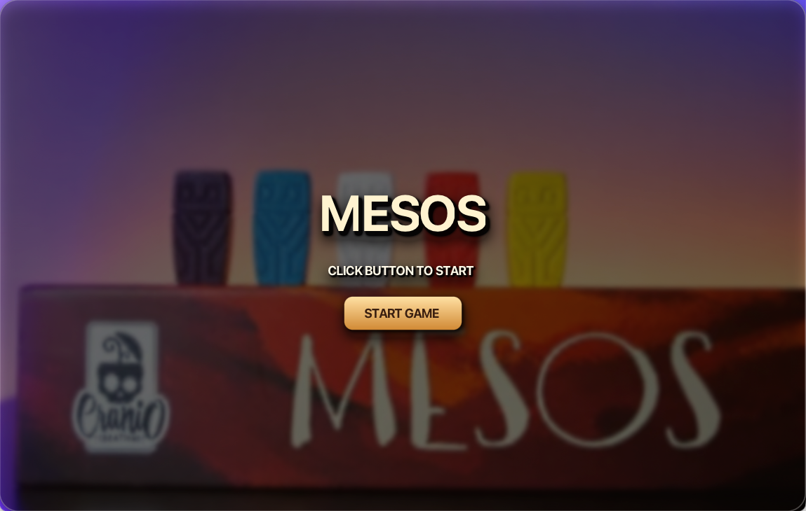
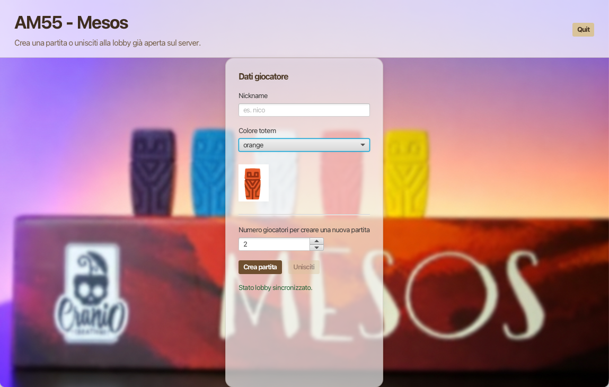
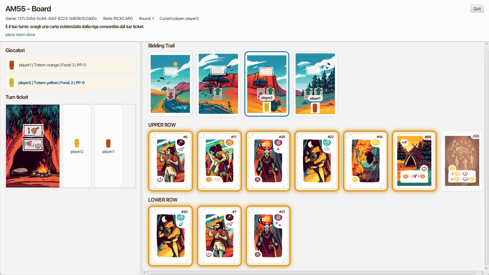
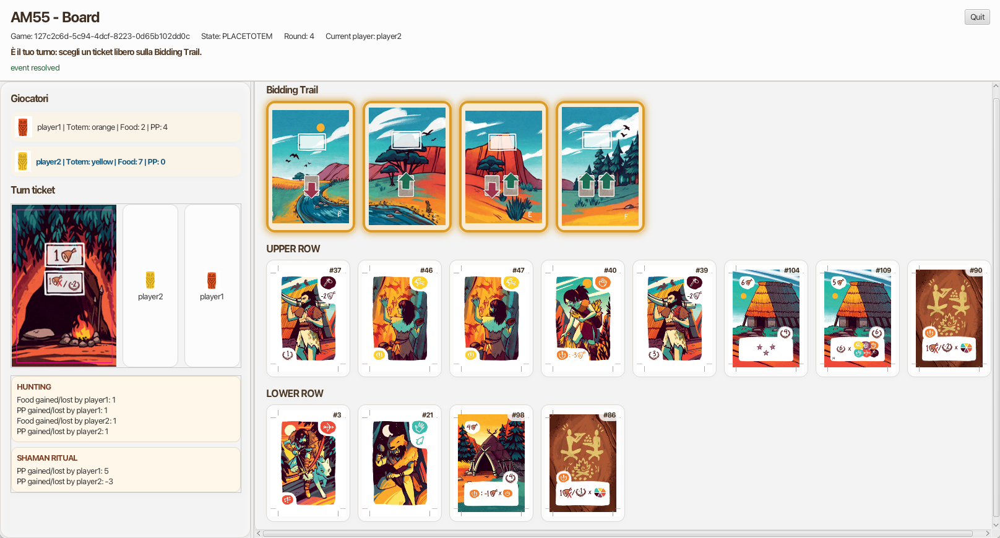
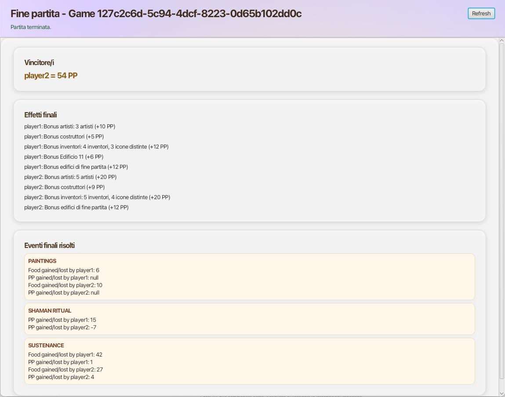

# Ingegneria del software 2025/2026

## Software Engineering Project - Polimi 
 Digital version of the game Mesos made by Team AM55
- Bontempi Francesco
- Cagnazzo Giacomo
- Diana Nicolò
- Di Girolamo Daniele

official game site: [Mesos-CranioCreation](https://www.craniocreations.it/prodotto/mesos)

[**Game rules** (IT)](readmeFiles/mesos-rules-it.pdf)

Final Project of Software Engineering at Polytechnic University of Milan. A.Y. 2025/2026. Prof. Alessandro margara

## ScreenShots

  
   

  
  

  

## Functionalities

[**Requirements** (IT)](readmeFiles/requirements.pdf)

Those are the functionalities we have implemented:

| Functionality                | State |
|:-----------------------------|:-----:|
| Basic rules                  |   ✅   |
| Complete rules               |   ✅   |
| TUI                          |   ✅   |
| GUI                          |   ✅   |
| RMI                          |   ✅   |
| Socket                       |   ✅   |
| Database                     |   ✅   |
| Multiple games               |   ❌   |
| Persistence                  |   ❌   |
| Resilience to Disconnections |   ❌   |

## Set Up

This section contains all instructions about how to run this project.

### Database
make sure to Download on every device [*MySQL*](https://dev.mysql.com/downloads/mysql/8.0.html)

- Download latest database edition there: [**Database**](readmeFiles/mesos-rules-it.pdf)

### Server

- Download latest Server edition there: [**Server**](jars/)
- Run in terminal: `java -jar `

### Client

- Download latest Client edition there: [**Client**](jars/)
- Run in terminal: `java -jar `
- 

## How to run from IDE (IntelliJ IDEA)

**Server**
- Run `Server`
- share the Server IP with your friends

**Client**
- Run `Client`
- Set:
  - server IP 
  - Socket or RMI connections 
  - CLI or GUI

## License
[Mesos](https://www.craniocreations.it/prodotto/mesos) is property of [Cranio Creations](https://www.craniocreations.it)
and all the copyrighted graphical assets used in this project were supplied by
[Politecnico di Milano](https://www.polimi.it) in collaboration with their rights' holders

